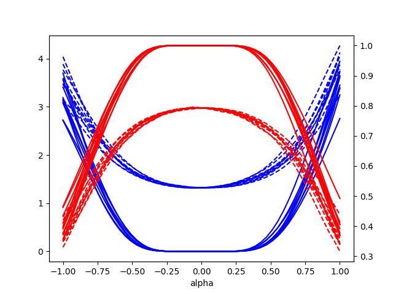

# Introduction

This repo implements parts of the visualizing methods of [Visualizing the Loss Landscape of Neural Nets. NIPS, 2018](https://arxiv.org/abs/1712.09913)

# Usage

**Installation**:

```
pip install -r requirements.txt
```

**Running example code:**

```
python main.py --model resnet
```

**Run it on custom data:**

Copy the plotLandscape.py file to the target folder, and use it like the example shown in main.py

# Result Demonstration

The result of trained_model/ex1/final.pth

Red lines: loss

Blue lines: accuracy

Solid lines: train

Dashed lines: test

